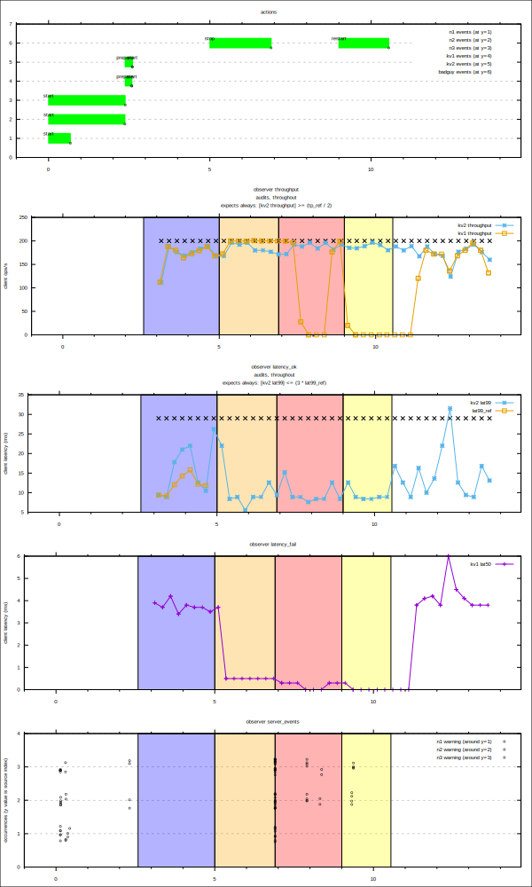

# shakespeare

**shakespeare** is a scenario-based testing framework for distributed
processes.

It orchestrates the execution and monitoring of multiple concurrent
test processes and synthetizes test results including plots of
activity over time.

- [How it works](#How-it-works)
- [Command line parameters](#Command-line-parameters)
- [Example: traffic and red lights](#Example-traffic-and-red-lights)
- [Example: CockroachDB sustaining client traffic while a node is  down](#Example-CockroachDB-sustaining-client-traffic-while-a-node-is-down)

## How it works

1. shakespeare reads a configuration from its standard input that defines:
   - one or more *actors*, each playing a *role* (multiple actors can play the same role);
   - a *script* that defines what the actors should be doing over time;
   - optionally, to obtain diagrams of the behavior:
     - *spotlights* that shine upon the actors during a play, to extract observable data;
     - an *audience* of observers during the play;
   - optionally, to verify the behavior:
     - *auditors* that check whether the actors perform well.

2. shakespeare reads the configuration from its standard input and
   compiles the script to a *sequence of scenes* for the actors to
   follow.

   At each scene, the following can happen:
   - an actor can be called to perform some *actions* (a command is executed);
   - the *mood* of the stage can be altered (a period of interest is marked in the output diagrams);

3. shakespeare brings the conductor on stage. The play begins. The
   conductor does the following:

   - calls the spotlights to shine upon the actors (starts the monitoring processes)
   - instructs the actors to carry out the steps defined by the script (runs action commands)
   - calls the actors to leave the scene (runs the role cleanup commands)

5. meanwhile, each observer in the audience scrutinizes one or more
   actor as revealed by their spotlight: plottable data is gathered by
   filtering the monitoring data.

5. meanwhile, each auditor scrutinizes the actors and checks that
   their performance is acceptable: behavior signals are checked
   for specified acceptance criteria defined by predicates.

6. at the end of the play, the audience and auditors report on their
   experience (plots and test results are produced).

## Command line parameters

| Parameter      | Default | Description                                                                                          |
|----------------|---------|------------------------------------------------------------------------------------------------------|
| `-output-dir`  | `.`     | Directory where to generate artifacts, output data files and the plot script.                        |
| `-print-cfg`   | false   | Print configuration after parsing and compilation.                                                   |
| `-n`           | false   | Stop after parsing the configuration and compiling the steps (do not actually execute the script).   |
| `-q`           | false   | Run quietly (equivalent to `-logtostderr=NONE`)                                                      |
| `-log-dir`     | (empty) | If non-empty, copy the logs to that directory.                                                       |
| `-logtostderr` | INFO    | Copy every log message at or above this threshold to stderr (use NONE to disable reports to stderr). |

## Example: traffic and red lights

A [separate document page](docs/redlight.md) introduces the main
features of `shakespeare` using a running example.

The example orchestrates two play characters: a road where traffic
occurs, and a traffic light meant to stop or let traffic flow.
Example behavior diagram:

The top plot shows the actions carried out by `shakespeare` on the system.
The bottom plot shows how the system reacted.

([link to configuration](examples/redlight3.cfg) — [link to doc](docs/redlight.md))

## Example: CockroachDB sustaining client traffic while a node is down

This example shows the behavior of a 3-node CockroachDB clusters with
two "KV workload" clients. The node to which one of the two clients is
connected is brought down two times gracefully. The behavior plot
shows that the other client's throughput remains stable during the
downtime.

The top plot shows the actions carried out by `shakespeare` on the system.
The bottom plots show how the system reacted.

([link to configuration](examples/kv3.cfg))
