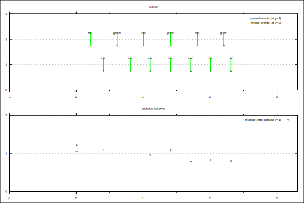
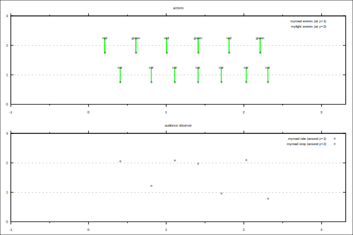

# Introduction: traffic and red lights

The following example orchestrates two play characters: a road where
traffic occurs, and a traffic light meant to stop or let traffic flow.

The goal of this example is to bring a simple car/traffic behavior
under scrutiny. We want to *observe* how the defined cars react to
changes in the traffic light, and *check* that they obey simple
traffic rules.

- [Cast](#Cast)
- [Roles](#Roles)
- [Script](#Script)
- [Audience and spotlights](#Audience-and-spotlights)
- [Example configuration (simplified)](#Example-configuration-simplified)

## Cast

To achieve this, we will define a cast of two characters:

- `myroad` plays the role of a road, where cars ride
- `mylight` plays the role of a traffic light, placed alongside `myroad`.

We write this as follows:

```
cast
  myroad plays road
  mylight plays redlight(road=myroad)
end
```

Naturally, Shakespeare does not know anything about the `road` and
`redlight` roles yet. We need to explain those first.

## Roles

A road supports a `car` action:

```
role road is
  :car  <..omitted..>
  ...
end
```

(We'll detail the behavior of a car later below.)

Meanwhile, we define the other role `redlight` with two actions `red` and `green`.

```
role redlight is
  :red    <..omitted..>
  :green  <..omitted..>
end
```

(Again, we'll define the behaviors later below.)

## Script

The script instructs the actors how to play their roles over time.
Each actor is instructed (*prompted*) to perform actions, grouped into *scenes*.

The configuration to specify this looks like this:

```
script
   ...
  prompt myroad  ....c...c..c..c..c..c..c...
  prompt mylight ..r...g...r...g...r...g....
end
```

Each `prompt` specification provides a *script line* to execute for an actor.

This particular configuration tells `myroad` to perform action `c` at
various times. Likewise, `mylight` is to perform actions `r` and `g`
at various times.

Each column across all lines in the script correspond to one
scene. The actions from all lines inside a single scene (column) are
allowed to execute concurrently. However, a scene must complete
(actions from each line in the column must terminate) before the next
scene can start.

Therefore, in the script above, generally the `c`, `r` and `g` actions
are specified to occur separately over time, except for the 4th
occurrence of `c` which can occur concurrently with `g`.

In this script, the action letters `c`, `r` and `g` are not yet defined.
We do this by specifying these letters as follows:

```
script
  ...
  action . entails nop
  action c entails :car
  action r entails :red
  action g entails :green
  prompt ...
end
```

Finally, a script must define a minimum *tempo* at which scenes are
carried out. This is necessary because it is possible for the roles to
only define "instantaneous" actions, whereas it may be desirable to
play them at instants stretched out over real time.

In this example, we'll perform scenes at a minimum of 100ms intervals:

```
script
  tempo 100ms
  action . entails nop
  action c entails :car
  action r entails :red
  action g entails :green
  prompt myroad  ....c...c..c..c..c..c..c...
  prompt mylight ..r...g...r...g...r...g....
end
```

## Audience and spotlights

`shakespeare` can organize flows of *observations* from the system
undergoing testing into output files, and behavior plots.

This is organized as follows:

- on the observation side:
  - *spotlights* are asynchronous processes that are set up to run concurrently
    with the entire scenario. Each role can define a spotlight; the spotlight
    shines on every character playing the role.
  - *signals* are filters defined over the output data stream from a spotlight,
    and splits this data into separate named data streams.

  For example, spotlights can read a log file and signals used to
  extract sub-streams of monitored data from the single log file.

- on the collection side, an *audience* selects one or more signal to
  collect and plot data from.

In the example above, we will define that the `car` action produces
data in a traffic log, and define a spotlight to collect data from this traffic log:

```
role road is
  :car  <..omitted..>   >>traffic.log
  spotlight touch traffic.log; tail -f traffic.log
  signal traffic event at (?P<ts_now>)(?P<event>.*)
  cleanup rm -f traffic.log
end
```

This spotlight uses the `tail` command which watches the file for new
events and prints them out.

The `signal` specification (syntax detailed further below) extract all
the text lines from the traffic log as `traffic` events.

The `cleanup` specification tidies up at the end of the test.

Then we collect these events via an audience:

```
audience
  observer watches myroad traffic
end
```

This defines one audience member called `observer`, and configures it to collect
all `traffic` events from `myroad`.

## Example configuration (simplified)

Here is a valid configuration collecting all the elements seen so far:

```
role road is
  :car      echo car rides >> traffic.log  # we'll replace this later
  spotlight touch traffic.log; tail -F traffic.log
  signal    traffic event at (?P<ts_now>)(?P<event>.*)
  cleanup   rm -f traffic.log
end

role redlight is
  :red   true # we'll replace this later
  :green true # we'll replace this later
end

cast
  myroad plays road
  mylight plays redlight(road=myroad)
end

script
  tempo 100ms
  action . entails nop
  action c entails :car
  action r entails :red
  action g entails :green
  prompt myroad  ....c...c..c..c..c..c..c...
  prompt mylight ..r...g...r...g...r...g....
end

audience
  observer watches myroad traffic
end
```

## Example output diagram

When executed through `shakespeare`, the scenario defined above is
carried out and the traffic data is collected in a CSV file. A Gnuplot
script is also produced, which upon execution produces the following
diagram:



The top plot shows the actions that were carried out by the script.
The bottom plot shows the behavior that resulted.

(The image is a SVG with hyperlinks: when viewed *outside of the
Github interface*, the event points in the bottom plot display the
event text when hovered by the mouse cursor.)

## Keeping the cars stopped

The configuration above has the cars ride on the road regardless of
the state of the traffic light. This can cause accidents.

We actually would like to see the cars stop when the light is
red. We'll define this as follows:

```
role road is
  :car  if test -e blocked; then \
          echo "car stopped"; \
        else \
          echo "car rides"; \
        fi >>traffic.log
  spotlight touch traffic.log; tail -F traffic.log
  signal ride event at (?P<ts_now>)(?P<event>car rides)
  signal stop event at (?P<ts_now>)(?P<event>car stopped)
  cleanup rm -f traffic.log
end

role redlight is
  :red   touch ../$road/blocked
  :green rm -f ../$road/blocked
end
```

This instructs the road to only let car rides when the file named
`blocked` does not exist. Concurrently, the red light will either
create or remove the `blocked` file depending on the action played.

Notice how the `red` and `green` action use the shell parameter
`$road`. This refers to the parameter [configured in the cast](#Cast)
above:

```
  mylight plays redlight(road=myroad)
```

The new `road` role defines two signals `ride` and `stop`, which we
now must observe separately:

```
audience
  observer watches myroad ride
  observer watches myroad stop
end
```

Splitting the signals yields two separate curves in the behavior plot:



([link to configuration](../examples/redlight2.cfg))

Again the top plot show the action. Now the bottom plot has separated
the ride and stop events into two areas (separate y-values). As
intended, the cars only ride when the light has not been red recently.

## Clarifying periods of interest with moods

In the last plot above, it is not so easy to visually match periods
where the light was red with traffic events.

To clarify this, shakespeare can color the background of the plot
during specific periods.

The periods are defined as the *mood* of the play. The mood is
influenced as pseudo-actions in the script.

For example, we can extend the [script defined above](#Script) as follows:

```
script
  ...
  action r entails :red; mood red
  action g entails :green; mood clear
  ...
```

This specifies that the script letter `r` now both performs the `:red`
action and set the current mood of the play to `red`.

The resulting plot looks like this:


([link to configuration](../examples/redlight3.cfg))

By introducing moods, we can more easily verify (visually) that no car
rides during a red period, and that cars only ride during a clear
(non-red) period.
